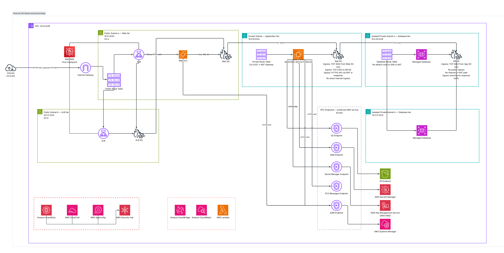
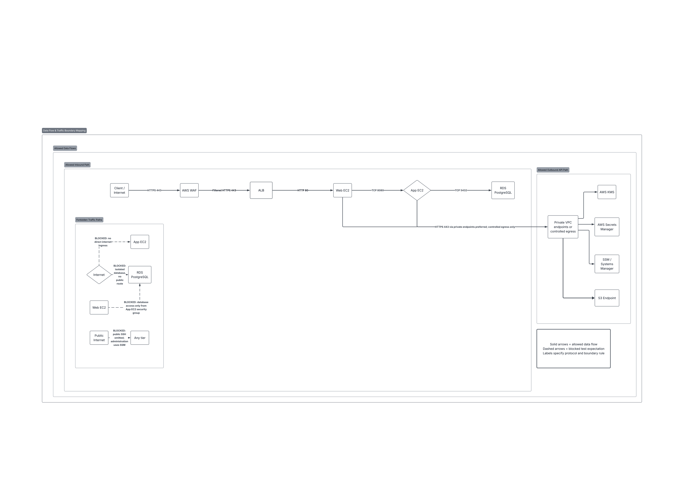
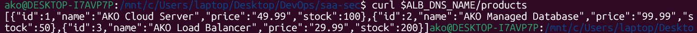

# Secure Multi-Tier AWS Architecture

## Overview
Secure Multi-Tier AWS Workload with Automated Threat Detection, Compliance Auditing & Event-Driven Incident Response.

The architecture touches: network segmentation, Zero Trust, Least Privilege, Encryption, Automated Threat Detection, Compliance Auditing & Event-Driven Incident Response.

## Architecture
- **Web Tier:** NGINX
- **App Tier:** Node.js
- **Database Tier:** Amazon RDS for PostgreSQL

## Data flow

## Security Controls
- **AWS WAF:** Layer 7 application protection
- **GuardDuty & Security Hub:** Threat detection and posture management
- **AWS Config:** Configuration compliance monitoring
- **Secrets Manager & KMS:** Secrets protection and encryption at rest
- **EventBridge, SSM & Lambda:** Automated remediation and incident response
- **CloudTrail:** Comprehensive auditing

## Setup Instructions
*(Requirements: aws, terraform)*

1. Execute `source ./scripts/deploy.sh`  (from the main directory).
2. Use `curl` to reach the app from the terminal: 
	eg. `curl $ALB_DNS_NAME/products`
	
3.  To clean up: `bash ./scripts/destroy.sh`  (from the project directory).

## Scenarios Demonstrated
(Refer to `docs/threat-model.md` for more details)
1. Network Isolation
2. Configuration Drift & Automated Remediation
3. Security Incident Response

										           AKO 2026
