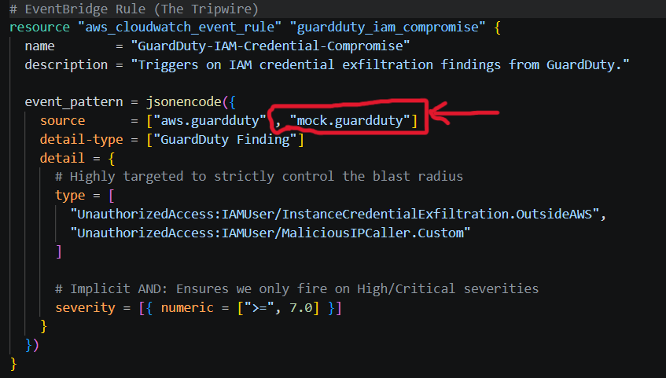

### Instructions:

1. Create a disposable IAM user and generate an access key. 

	```bash
	aws  iam  create-user  --user-name  test-compromised-user
	```
	```bash
	KEY_OUTPUT=$(aws iam create-access-key --user-name my-iam-user \
				--query 'AccessKey.[AccessKeyId,SecretAccessKey]' \
				--output text)
	```
<br>


2. Getting the AccessKeyId from the output.

	```bash
	read -r TEMP_ACCESS_KEY_ID TEMP_SECRET_ACCESS_KEY <<< "$KEY_OUTPUT"
	```

	```bash
	export TEMP_ACCESS_KEY_ID
	```

	```bash
	export TEMP_SECRET_ACCESS_KEY
	```	
<br>


3. You also must add `mock.guardduty` as a Source in GuardDuty-IAM-Credential-Compromise :

	Either from AWS console (in Amazon EventBridge Rules) or directly from Terraform, then apply.
	( `terraform/lambda/main.tf` resource "aws_cloudwatch_event_rule" "guardduty_iam_compromise").

	

	**Don't forget to REMOVE it when you finish testing !!!!**
<br>


4. Push the event directly to the default EventBridge bus. This simulates GuardDuty detecting credential exfiltration in real-time and immediately trips the EventBridge rule we built in Terraform.


	```bash
	aws  events  put-events  --entries  '[{"EventBusName": "default", "Source": "mock.guardduty", "DetailType": "GuardDuty Finding", "Detail": "{\"type\":\"UnauthorizedAccess:IAMUser/InstanceCredentialExfiltration.OutsideAWS\",\"severity\":8.0,\"resource\":{\"resourceType\":\"AccessKey\",\"accessKeyDetails\":{\"userName\":\"test-compromised-user\",\"accessKeyId\":\"$TEMP_ACCESS_KEY_ID\"}}}"}]'		```
<br>


5. Check the live status of the IAM user's access keys.

	```bash
	aws  iam  list-access-keys  --user-name  test-compromised-user
	```
	Look for "Status": "Inactive". The threat is contained.
<br>
<br>


6. Verify that the function successfully emitted the structured JSON log to CloudWatch. (This may take 5-10 seconds for the log stream to become available).

	```bash
	aws  logs  tail  /aws/lambda/Security-Auto-Containment-IAM  --since  1h
	```
<br>


7. Delete the test user and its access key

	```bash
	aws  iam  delete-access-key  --user-name  test-compromised-user  --access-key-id $TEMP_ACCESS_KEY_ID
	```

	```bash
	aws  iam  delete-user  --user-name  test-compromised-user
	```
<br>


8.  **Don't forget to REMOVE `mock.guardduty` from a Source in GuardDuty-IAM-Credential-Compromise !!!!**
Take a look at step 2.
